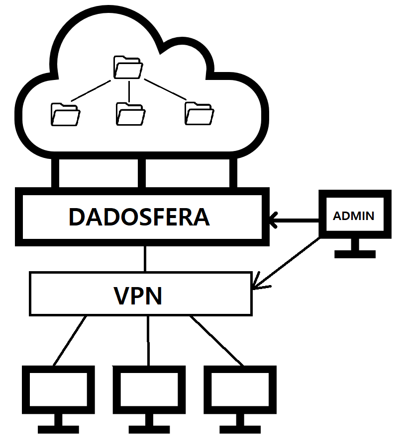

# Case 3

A plataforma estará vinculada aos sistemas da empresa, e com isso, os usuários só terão acesso aos arquivos do diretório quando logados no sistema da empresa. A permissão para acesso será dada a dispositivos que façam parte da rede da empresa, seja quando conectados fisicamente ou através de uma *Virtual Private Network* (VPN) específica instalada pelos administradores. Sem as permissões instaladas no dispositivo, a plataforma torna-se inacessível. Caso o usuário perca o direito de acesso, suas  permissões são revogadas no sistema.  
Os administradores são responsáveis por gerenciar quais são os usuários e dispositivos que possuem acesso à plataforma. Eles configuram a VPN de forma a permitirem o acesso de usuários permitidos à *endpoints* relacionados a plataforma, e também acompanham as permissões de acesso de cada usuário. Aos usuários cabe somente a tentativa de acesso à plataforma a partir de dispositivos liberados e devidamente conectados à VPN.  
A priorização deve ser a permissão de acesso. É mais importante não permitir o acesso de pessoas não autorizadas do que qualquer outra restrição, garantindo assim a segurança dos dados da empresa.  
É possível ver uma ideia do esquemático do projeto na Figura 1.

  
Figura 1 - Esquemático da plataforma de gerenciamento de diretório em nuvem

A auditoria atuará na verificação da segurança dos dados, na garantia de método de autenticação e na infraestrutura do sistema.
